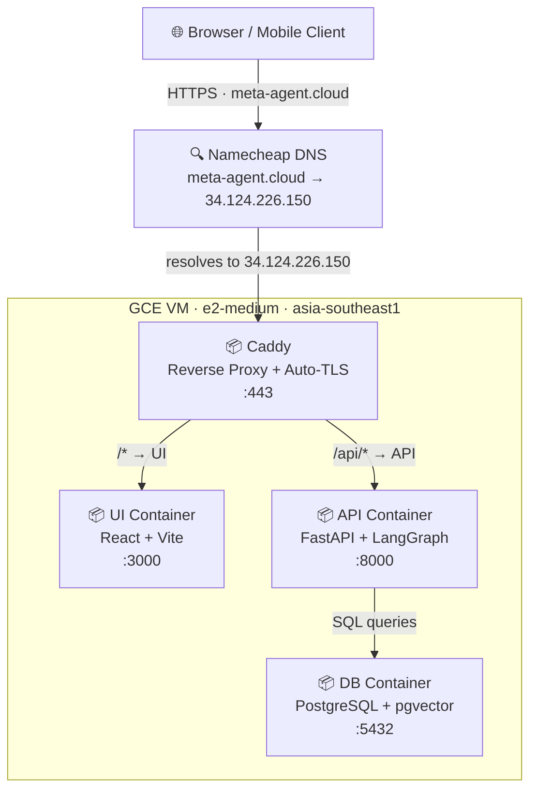

<h1 align="center">CS Meta-Agent</h1>

<p align="center">
  
  
  
  
  
  
  
  
  
  

</p>

A customer service platform where managers create, configure, and manage AI-powered CS agents via a web UI. Each agent has a Zendesk knowledge base, configurable instructions, and bindable tools.

## 🌐 Live Demo

### 👉 [https://meta-agent.cloud](https://meta-agent.cloud)

The Atome Card Support agent is pre-configured and ready to chat. A guided product tour launches automatically on first visit — it walks through every feature step by step. You can skip it or re-trigger it anytime via the **?** button in the header.

**Try these to explore the full feature set:**

| What to try | How |
|---|---|
| Ask the bot a KB question | *"How do I activate my card?"* |
| Trigger a business tool | *"What's my application status?"* (bot will ask for your user ID) |
| Open an article preview | Click any blue **Relevant sources** chip below a bot reply |
| Report a bad answer | Click the **🚩 Report** flag on any bot message |
| Run auto-fix | Open **Feedback Reports** → click **Run Fix** on an open report |
| Create a second agent | Click **+ New Agent** in the sidebar and paste any Zendesk help center URL |

---

## Overview

- **Part 1:** A working CS bot for Atome — created through the UI after deploy
- **Part 2:** A meta-agent system where managers can create and manage multiple CS agents

The Atome bot is simply the first agent created through the meta-agent UI. One architecture, one code path.

## Tech Stack

| Layer | Technology |
|-------|-----------|
| Frontend | React 18 + Vite + TailwindCSS |
| Backend | Python 3.11, FastAPI, LangGraph |
| LLM | Claude Opus 4.6 (chat + auto-fix) |
| Embeddings | OpenAI `text-embedding-3-small` |
| Database | PostgreSQL 16 + pgvector |
| Proxy | Caddy (auto-HTTPS via Let's Encrypt) |
| Deployment | Docker Compose on GCE `e2-medium` — **https://meta-agent.cloud** |

## Architecture on Production



## Features

- **Multi-agent management** — create and configure multiple CS agents from a single UI
- **Zendesk KB indexing** — paste a Zendesk help center URL, articles are fetched and embedded automatically
- **LangGraph ReAct runtime** — tool-calling loop handles KB search, business tools, and clarification questions uniformly
- **Tool binding** — bind business tools (application status, transaction lookup, etc.) to agent instructions
- **Mistake reporting & auto-fix** — report wrong answers, run fix to diagnose + update instructions + verify with before/after replay
- **Article viewer** — renders Zendesk articles in an iframe via backend proxy
- **Guided product tour** — first-visit walkthrough via React Joyride

## Project Structure

```
backend/
├── main.py               # FastAPI app, CORS, startup hooks
├── db.py                 # asyncpg pool + table creation
├── models.py             # Pydantic request/response models
├── config.py             # env var loading
├── routers/
│   ├── agents.py         # CRUD + reindex
│   ├── chat.py           # POST /api/agents/{id}/chat
│   ├── mistakes.py       # report + fix
│   ├── tools.py          # GET /api/tools
│   ├── proxy.py          # GET /api/proxy-article
│   └── health.py         # GET /api/health
└── services/
    ├── kb/zendesk.py     # Zendesk API client
    ├── kb/indexer.py     # crawl → embed → upsert
    ├── tools.py          # tool catalog + mock implementations
    ├── prompts.py        # system prompt builder
    ├── runtime.py        # LangGraph create_react_agent
    ├── mistakes.py       # auto-fix + verification replay
    └── embeddings.py     # OpenAI embedding wrapper

frontend/
├── Dockerfile
├── package.json
├── vite.config.js
├── tailwind.config.js
├── index.html
└── src/
    ├── App.jsx
    ├── main.jsx
    ├── index.css
    ├── api.js                # fetch wrappers for all API calls
    └── components/
        ├── AgentList.jsx     # sidebar: list agents + empty state + create button
        ├── AgentEditor.jsx   # name, KB URL, instructions, tool binding, save buttons
        ├── ChatWindow.jsx    # chat UI + references + related questions + article viewer
        ├── MistakeReport.jsx # report mistake modal
        └── MistakeDashboard.jsx  # feedback list + run fix + before/after display
```

## Local Setup

### Prerequisites

- Docker + Docker Compose
- Python 3.11+ and `uv`
- Node.js 20+
- API keys: Anthropic and OpenAI

### 1. Clone and configure

```bash
git clone https://github.com/LouisAnhTran/meta-agent.git
cd meta-agent
cp .env.example .env
```

Edit `.env`:

```
POSTGRES_PASSWORD=yourpassword
ANTHROPIC_API_KEY=sk-ant-...
OPENAI_API_KEY=sk-...
```

---

### Option A — Full Docker (recommended for production/demo)

```bash
docker compose up --build
```

- UI: `http://localhost`
- API docs: `http://localhost:8000/docs`
- pgAdmin: `http://localhost:5050`

---

### Option B — Local dev (faster iteration)

Run only the database in Docker, backend and frontend locally.

**Step 1 — Start db + pgAdmin:**
```bash
docker compose up db pgadmin
```

**Step 2 — Run backend:**
```bash
cd backend
cp ../.env .env        # copy env vars into backend/
uv sync                # install dependencies
source .venv/bin/activate
uvicorn main:app --reload --port 8000
```

**Step 3 — Run frontend:**
```bash
cd frontend
npm install
npm run dev            # runs on http://localhost:5173
```

Vite proxies `/api` to `localhost:8000` automatically — no Caddy needed.

---

### Verify

```bash
curl localhost:8000/api/health
# {"status":"ok","db":true,"anthropic":true,"openai":true}
```

Open `http://localhost:5173` in your browser.

---

## Zendesk API Reference

Useful for inspecting the raw KB data before indexing:

```bash
# List all sections in a category
curl "https://help.atome.ph/api/v2/help_center/en-gb/categories/4439682039065/sections.json?per_page=100" | python3 -m json.tool

# List all articles in a category
curl "https://help.atome.ph/api/v2/help_center/en-gb/categories/4439682039065/articles.json?per_page=100" | python3 -m json.tool
```

### 4. Create the Atome agent

Once the UI loads, create your first agent:

| Field | Value |
|-------|-------|
| Name | `Atome Card Support` |
| KB URL | `https://help.atome.ph/hc/en-gb/categories/4439682039065-Atome-Card` |
| Instruction 1 | `If the customer asks about their card application status, ask for their user ID, then look it up and tell them the result.` → bind `get_application_status` |
| Instruction 2 | `If the customer asks about a failed transaction, ask for the transaction ID, then look it up and tell them the result.` → bind `get_transaction_status` |

Click **Save & Re-index** and wait ~30–60 seconds for indexing to complete.

## API Endpoints

| Method | Path | Description |
|--------|------|-------------|
| `GET` | `/api/health` | Health check |
| `POST` | `/api/agents` | Create agent |
| `GET` | `/api/agents` | List agents |
| `GET` | `/api/agents/{id}` | Get agent |
| `PUT` | `/api/agents/{id}` | Update agent (+ optional reindex) |
| `DELETE` | `/api/agents/{id}` | Delete agent |
| `POST` | `/api/agents/{id}/chat` | Chat with agent |
| `GET` | `/api/agents/{id}/mistakes` | List mistakes |
| `POST` | `/api/agents/{id}/mistakes` | Report mistake |
| `PUT` | `/api/mistakes/{id}/fix` | Run auto-fix |
| `GET` | `/api/tools` | Tool catalog |
| `GET` | `/api/proxy-article` | Proxy Zendesk article for iframe |

## Database Admin

pgAdmin is included. Open `http://localhost:5050` and connect with:

- **Host:** `db` · **Port:** `5432` · **Database:** `csagent` · **Username:** `postgres`

## Common Commands

```bash
docker compose up --build        # build and start
docker compose down              # stop (data preserved)
docker compose down -v           # stop + wipe all data
docker compose logs -f api       # tail backend logs
```

## Design Decisions

- **Zendesk API over HTML scraping** — clean JSON, no Cloudflare issues, works for any Zendesk help center
- **pgvector over Pinecone** — at ~15K vectors, a dedicated vector DB is unjustified; one DB for config + vectors + mistakes
- **LangGraph `create_react_agent`** — pre-built ReAct loop; ~10 lines of agent setup
- **System prompt derived, not stored** — shared base template + per-agent instructions assembled at request time; no duplication in DB
- **No seed script** — the Atome bot is created through the meta-agent UI, proving Part 1 and Part 2 share the same code path
